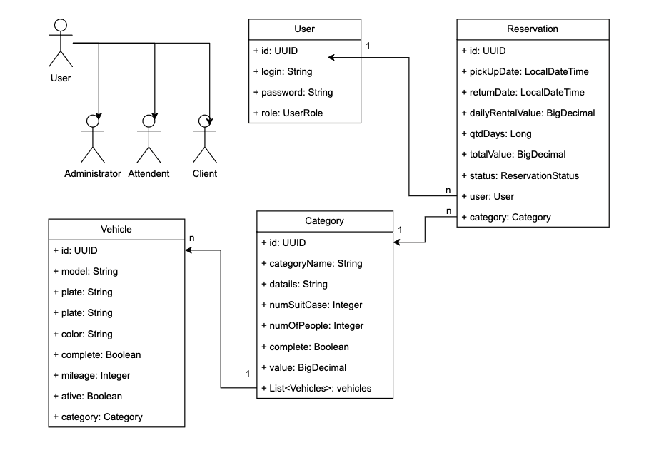

# PROJECT CAR RENTAL

> Status: Developing 


## Objective
The objective of this project is the development of an API to meet the demands of a medium size vehicle rental company. Located in a medium town with just one store.


## Specific Objectives
Facilitate the presentation of the company and it's services to the customer throrgh the platform. CRUD of vehicles and customers


## Project Structure
+ CONTROLLERS (DTO's)
+ SERVICES (Entities <-> DTO's)
  * Impl
+ REPOSITORIES (Entities)
+ DOMAIN
  * DTOS
  * ENUMS
  * EXCEPTIONS
  * MAPPER
  * MODELS (Entities)
+ Infra 
  * Security


## Clone Project and Run Using Docker
Clone the project
```bash
  git clone https://link-para-o-projeto
```

Enter the project diretory
```bash
  docker-compose up --build
```

## Features Developmented
+ ✅ Project and it's structure
+ ✅ Modelos and entities
+ ✅ Configuration of database
+ ✅ Repositories
+ ✅ Configuration of Spring Security and JWT Token
+ ✅ CRUD a user
+ ✅ Automation of admin and attendent
+ ✅ User login
+ ✅ CRUD a vehicle
+ ✅ CRUD a categorie
+ ✅ CRUD a reservation

## Entities

 

## Desired Operations
* Register User:
Register a user in the api passing datas by JSON 
* Read User:
Read a user in the api, for name or list of users
* Update User:
Update a user in the api passing the identification id
* Delete User:
Delete a user in the api passing the identification id

* Register Vehicle:
Register a Vehicle in the api passing datas by JSON 
* Read Vehicle:
Read a Vehicle in the api, for name or list of vehicles
* Update Vehicle:
Update a Vehicle in the api passing the identification id
* Delete Vehicle:
Delete a Vehicle in the api passing the identification id

* Register Category:
Register a Category in the api passing datas by JSON 
* Read Category:
Read a Category in the api, for name or list of categories
* Update Category:
Update a Category in the api passing the identification id
* Delete Category:
Delete a Category in the api passing the identification id

* Register Reservation:
Register a Reservation in the api passing datas by JSON 
* Read Reservation:
Read a Reservation in the api, for name or list of resercations
* Cancel a Reservation:
Cancel a Reservation in the api passing the identification id


## Technologies
* Java
* Spring Boot Starter Web
* Spring Boot Devtools
* Spring Boot Starter Data JPA
* MySQL Data Base
* MySQL Driver
* Spring Boot Starter Security
* Java Docks
* MapStruct

## API Documentations

### Endpoints Using Swagger:
````
http://localhost:8000/car-rental/swagger-ui.html
````

### Endpoints Users:

```http
  POST /auth/login
```
| Parâmetro   | Tipo       | Descrição                           |
| :---------- | :--------- | :---------------------------------- |
| `login` | `string` | **Required**. User login |
| `password` | `string` | **Required**. User password |


```http
  POST /auth/register
```
| Parâmetro   | Tipo       | Descrição                           |
| :---------- | :--------- | :---------------------------------- |
| `login` | `string` | **Required**. User login |
| `password` | `string` | **Required**. User password |


```http
  GET /user/all
```
| Parâmetro   | Tipo       | Descrição                           |
| :---------- | :--------- | :---------------------------------- |
| `token` | `string` | **Required**. Token retornado pelo login |


```http
  GET /user/me
```
| Parâmetro   | Tipo       | Descrição                           |
| :---------- | :--------- | :---------------------------------- |
| `token` | `string` | **Required**. Token retornado pelo login |


```http
  PUT /user
```
| Parâmetro   | Tipo       | Descrição                           |
| :---------- | :--------- | :---------------------------------- |
| `token` | `string` | **Required**. Token retornado pelo login |


### Endpoints Vehicle:
```http
  GET /vehicle
```
| Parâmetro   | Tipo       | Descrição                           |
| :---------- | :--------- | :---------------------------------- |
| `token` | `string` | **Required**. Token retornado pelo login |


```http
  GET /vehicle/{id}
```
| Parâmetro   | Tipo       | Descrição                                   |
| :---------- | :--------- | :------------------------------------------ |
| `token` | `string` | **Required**. Token retornado pelo login |
| `id`      | `string` | **Required**. Vehicle UUID |


```http
  POST /vehicle
```
| Parâmetro   | Tipo       | Descrição                           |
| :---------- | :--------- | :---------------------------------- |
| `token` | `string` | **Required**. Token retornado pelo login |
| `model` | `string` | **Required**. Vehicle model |
| `plate` | `string` | **Required**. Vehicle plate |
| `color` | `string` | **Required**. Vehicle color |
| `complete` | `boolean` | **Required**. Vehicle is complete? |
| `mileage` | `integer` | **Required**. Vehicle mileage |
| `ative` | `boolean` | **Required**. Vehicle is active? |
| `categoryId` | `string` | **Required**. Category UUID |


```http
  PUT /vehicle/{id}
```
| Parâmetro   | Tipo       | Descrição                           |
| :---------- | :--------- | :---------------------------------- |
| `token` | `string` | **Required**. Token retornado pelo login |
| `id` | `string` | **Required**. Vehicle UUID |
| `model` | `string` | **Required**. Vehicle model |
| `plate` | `string` | **Required**. Vehicle plate |
| `color` | `string` | **Required**. Vehicle color |
| `complete` | `boolean` | **Required**. Vehicle is complete? |
| `mileage` | `integer` | **Required**. Vehicle mileage |
| `ative` | `boolean` | **Required**. Vehicle is active? |
| `categoryId` | `string` | **Required**. Category UUID |


```http
  DELETE /vehicle/{id}
```
| Parâmetro   | Tipo       | Descrição                                   |
| :---------- | :--------- | :------------------------------------------ |
| `token` | `string` | **Required**. Token retornado pelo login |
| `id`      | `string` | **Required**. Vehicle UUID |


### Endpoints Category:
```http
  GET /category
```
| Parâmetro   | Tipo       | Descrição                           |
| :---------- | :--------- | :---------------------------------- |
| `token` | `string` | **Required**. Token retornado pelo login |


```http
  GET /category/{id}
```
| Parâmetro   | Tipo       | Descrição                                   |
| :---------- | :--------- | :------------------------------------------ |
| `token` | `string` | **Required**. Token retornado pelo login |
| `id`      | `string` | **Required**. Category UUID  |


```http
  DELETE /category/{id}/vehicles
```
| Parâmetro   | Tipo       | Descrição                                   |
| :---------- | :--------- | :------------------------------------------ |
| `token` | `string` | **Required**. Token retornado pelo login |
| `id`      | `string` | **Required**. Category UUID  |


```http
  POST /category
```
| Parâmetro   | Tipo       | Descrição                           |
| :---------- | :--------- | :---------------------------------- |
| `token` | `string` | **Required**. Token retornado pelo login |
| `categoryName` | `string` | **Obrigatório**. Token retornado pelo login |
| `datails` | `string` | **Required**. Vehicle model |
| `numBigSuitCases` | `integer` | **Required**. Vehicle plate |
| `numSmallSuitCases` | `integer` | **Required**. Vehicle color |
| `numOfPeople` | `integer` | **Required**. Vehicle is complete? |
| `complete` | `boolean` | **Required**. Vehicle mileage |
| `value` | `float` | **Required**. Vehicle is active? |


```http
  PUT /category/{id}
```
| Parâmetro   | Tipo       | Descrição                           |
| :---------- | :--------- | :---------------------------------- |
| `token` | `string` | **Required**. Token retornado pelo login |
| `id`      | `string` | **Required**. Category UUID  |
| `categoryName` | `string` | **Obrigatório**. Token retornado pelo login |
| `datails` | `string` | **Required**. Vehicle model |
| `numBigSuitCases` | `integer` | **Required**. Vehicle plate |
| `numSmallSuitCases` | `integer` | **Required**. Vehicle color |
| `numOfPeople` | `integer` | **Required**. Vehicle is complete? |
| `complete` | `boolean` | **Required**. Vehicle mileage |
| `value` | `float` | **Required**. Vehicle is active? |


```http
  DELETE /category/{id}
```
| Parâmetro   | Tipo       | Descrição                                   |
| :---------- | :--------- | :------------------------------------------ |
| `token` | `string` | **Required**. Token retornado pelo login |
| `id`      | `string` | **Required**. Category UUID  |


### Endpoints Reservation:

```http
  POST /reservation
```
| Parâmetro   | Tipo       | Descrição                                   |
| :---------- | :--------- | :------------------------------------------ |
| `token` | `string` | **Required**. Token retornado pelo login |


```http
  GET /reservation/all
```
| Parâmetro   | Tipo       | Descrição                                |
| :---------- | :--------- | :--------------------------------------- |
| `token` | `string` | **Required**. Token retornado pelo login       |


```http
  GET /reservation/{id}
```
| Parâmetro   | Tipo       | Descrição                           |
| :---------- | :--------- | :---------------------------------- |
| `token` | `string` | **Required**. Token retornado pelo login |
| `id`      | `string` | **Required**. Reservation UUID  |


```http
  DELETE /reservation/{id}
```
| Parâmetro   | Tipo       | Descrição                           |
| :---------- | :--------- | :---------------------------------- |
| `token` | `string` | **Required**. Token retornado pelo login |
| `id` | `string` | **Required**. Reservation UUID |


